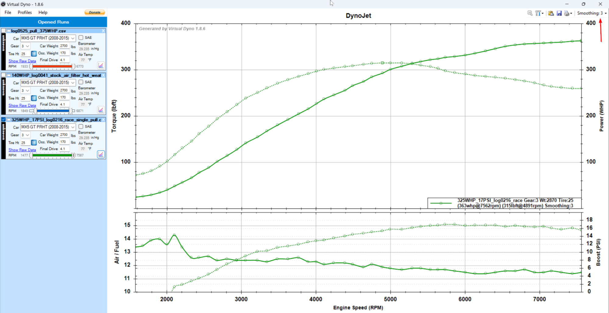

# NC Miata tuning

RomDrop edition


This document wouldn't exist without Speeps which single handedly reversed engineered our NC ECU and built RomDrop.

* Thank you Speeps

* Noteworthy individuals

  * Kwheels - Founder of the Facebook group and creator of the original quick starter guide.
  * VTECKiller - Moderator of the Facebook Group, constantly supports and helps everyone, probably has the most experience building and tuning 2.5.
  * Shifty35 - Probably the most knowledgeable individual of the group and also constantly supports and helps everyone.
  * NyxOne - That's me! 😁Don't hesitate to [contact me](mailto:dufresne.charles@gmail.com).

* About this document  
I've chosen this format for its ease of use and because it can be easily [downloaded offline](https://docs.google.com/document/d/1b4rhyg6aVLKPjBcbVLuTv8BVeTrC8zoHCeKqxaaMyYw/edit?usp=sharing) on your phone or computer, printed and even [displayed as a website](http://ncmiatatuning.s3-website.us-east-2.amazonaws.com/index.html).

# **READ ME (seriously)**

* Use the search function, don't worry, it won't hurt you.
* Print this guide, read it, take notes.
* Try to find answers on your own before asking for help.
* Be polite when asking for help, explain what's your setup, what you want to do and what you've tried. That'll save everyone's time and increase the likelihood of getting answered.

## **Other resources**

* [DIY Tuning Toolkit Development (Rabbit Hole).](https://forum.miata.net/vb/showthread.php?t=630805)  
  The thread that started it all.

* [RomDrop Open Source NC MX-5 Tuning](https://www.facebook.com/groups/romdrop).  
  Great way to reach a lot of people with a few great post, use the search function.

* [RomDrop Facebook messenger group.](https://www.facebook.com/messages/t/5986216474790292/)  
  A great place to reach active users.

* [KWheels quick starter guide.](https://docs.google.com/document/d/1hXBo-lRSHjpbmeMd-Ov7HrWVs_lx0mSl2Epq8xX40Lg/edit?usp=sharing)  
  A bit outdated but still a great resource for anyone starting.

* [Rabbit hole notes.](https://docs.google.com/document/d/1Qymdl2K2fghTf299lL89XtY6T7vGxulA9906ujB0MUQ/edit?usp=sharing)  
  Notes I took while reading the rabbit hole thread, more on the technical side of things. If you'd like to know more without reading

* [MX5 Turbo how to](https://docs.google.com/document/d/1q92jzCeni5XRhhC1h6u9REC96A2MLN2Njxks_F1-gWY/edit?usp=sharing)  
  If you've (or plan to) added a turbo or supercharger this document is great starting point and will help grasp what needs to be done in other to make the ECU deal with forced induction.

* Google and Youtube are your friends.  
  If you don't know how to take screenshots, install software, Youtube will be your friend.

* ChatGPT  
  It's free, just use it. I spend a lot of time chatting with it about various topics, just remember that it's a tool and can fail like any other tools.

# **Before you start**

## **Do you really want to do this ?**

Seriously! Do you know what you're getting yourself into ? You can actually brick your ECU, blow your engine, break laws and put your life at risk. On top of that it can get expensive quickly and is time consuming.

Here's a simple guide to help you decide:

### **Don't do it if**

* If all you want is to get a small bump in power after installing headers, a cold air intake, etc. Just ask a reputable tuner to do it.
* If you expect to find a tune in a box for your needs.
* If you want someone to tune your car for you.
* If you expect to be spoon fed every step of the way.
* If you have a busy schedule (working 40h+ with young kids won't work).
* If it's your daily.

### **Do it if**

* If you're curious and want to learn more.
* If you want to own and control your tune.
* If you expect/want to try different things (engine, cams, exhaust, turbo, etc).
* If you have disposable income.

### **Yes you can do it**

I am by no means an expert and I went from washing a car twice a year to installing a turbo kit, exhaust, cams, swapping a 2.5, have boost by gear with progressive water meth injection and now makes around 400 BHP. You can do it if that's what you want but you better buckle up because it's going to be a journey.

## **Is it running well ?**

Make sure your car is in good running condition. Don't be stupid and try to tune your car if the engine is stuttering, smoking, misfiring, has electrical issues, a bad catalyser, has a 10 year old battery, 10 year old spark plugs, had no oil in change in years, etc. Refusal to do so will make tuning hard if not pointless or even worse (I've bricked my ECU because my battery was on its last leg).

## **Don't know where to start ?**

Let me help you! You are here  >   *   <

Seriously though, here's my recommendations:

* Buy a Tactrix OpenPort 2 and while you wait
  * Continue reading this document.
  * Make sure your car is running well (I'll keep hammering it because it's important). Please make sure you car battery is not dying or you risk bricking your ECU (ask me how I know).
  * Download EcuFlash and RomDrop and experiment with it.
  * Learn how to download your ROM, patch it AND flash it.
  * Prepare a logcfg.txt

* Once you own Tactrix OpenPort 2
  * Download your ROM, save it somewhere safe, at least on your computer and somewhere else, I recommend something like Google drive.
  * Datalog, datalog, datalog. Make sure you have at least one healthy log with
    * Cold start and idle
    * Warm start and idle.
    * Cruising around town.
    * Cruising on the highway.
    * A few WOT pulls.

      This will serve you as a baseline, believe me you absolutely want to have this before you change anything.

  * Patch your ROM and flash it (it's OK to be nervous, I was shaking the first time).

* First tuning session
  * [Disable power enleanment].
  * [Tune load scaling], make sure your trims are under control, it makes everything else easier.
  * [Enable high ECT warning], it could save your engine (ask me how I know 😭).
  * Do something fun
    * [Learn to use VirtualDyno], trust me, it's fun.
    * [Remove the 2nd gear torque limiter]
    * [Adjust rev limiter].
    * [Tune AFR for power].
    * [Tune IMTV for power].
    * LS SWAP… Just kidding! 😂

# **Tools of the trade**

*Note*: Download links are for Windows only and I won't explain how to install it.

*Hint:* You can install EcuFlash and open a stock ROM and see the tables or MAPs the ECU uses while you wait for your Tactrix to arrive. You can find a [list of OEM ROMs here](http://ncmiatatuning.s3-website.us-east-2.amazonaws.com/index.html#)

* [Tactrix OpenPort 2.0](https://www.tactrix.com/index.php?option=com_virtuemart&page=shop.product_details&flypage=flypage.tpl&product_id=17&Itemid=53&redirected=1&Itemid=53)  
  Connects to your car - Read and write ROMs, data logs. Get a real one.

  *Hint:* Search your local Subaru Buy&Sell Facebook group for a used unit.

* [RomDrop web site](https://github.com/speepsio/romdrop) / [Download link](https://github.com/speepsio/romdrop/archive/refs/heads/master.zip) (free)  
  Use to update (flash) your ECU with a tune.

* [ECU Flash web site](https://www.tactrix.com/index.php?option=com_content&view=category&layout=blog&id=36&Itemid=57) / [Download link](https://www.tactrix.com/downloads/ecuflash_1444870_win.exe) (free)  
  Visualize and modify the content of your ECU, that's where the tuning part is done.

* [Virtual Dyno web site](https://barnhill.bitbucket.io/) / [Download link](https://barnhill.bitbucket.io/public/setup.zip) (free)  
  Needed if you're tuning for power and don't plan on using an actual dyno.

* [MegaLogViewerHD](https://www.efianalytics.com/MegaLogViewerHD/) / [Download link](https://www.efianalytics.com/MegaLogViewerHD/download/) ($$$)  
  Visualize data, required if you are serious about tuning.

* Excel ($$$)  
  Useful to visualize and manipulate data.

## **RomDrop - Setup and usage**

*Warning*: It's advised that you do not simultaneously run applications that consume heavy resources while flashing. Doing so can impact USB speeds which can result in a failed flash (BTW, a failed flash and all its blinking lights isn't the end of the world... it's recoverable).

### **Installation**

[Download](https://github.com/speepsio/romdrop/archive/refs/heads/master.zip) and unzip the files in a meaningful directory that's easily accessible. This is what you should expect to find once unzipped.  


### **Files and directories**

* Directories
  * colormaps: contains the Scooby colormap to make EcuFlash more visually appealing and readable.
  * logcfgs: contains a logcfg.txt sample to get you started.
  * metadata: contains the ROMs definitions for all the known ROMs.
  * patches: contains the patches of all known ROMs.
* Files
  * romdrop.exe: the software that does the read and write (flash) your ECU.
  * romdrop.crc: not a 100% but I think it's used by RomDrop for the Dynamic Flash function.

### **Functions**

* Clear Diagnostic Trouble Codes - Self explanatory.
* Dynamic Flash ROM - References last successful flash, and updates ROM blocks that have changed. Drastically decrease flash time. [Associate rom's file extension] to use this function with a simp.
* Flash Entire ROM - Flashes all ROM blocks to the ECU. Required if you've just patched your stock ROM. Flash times are ~90s.
* *Patch stock ROM - Patch a ROM to allow editing with ECU flash, this step is mandatory before editing in latest versions.
* Read ROM from ECU - Read the ROM in your ECU whether it's stock, one of your tunes or an encrypted tune from the tuner. *Always backup your stock ROM*.
* Sniff CAN Communications - The app can log 2MB of raw CAN communications. This is for the true hacker types.
* *Version for ROM - display ROM patch version, however it doesn't seem to work well with older versions of ROM.

*does not require Tactrix OpenPort to be plugged in.

### **Connection procedure (aka Interfacing with the ECU)**

* Connect openport to the vehicle OBD port.
* Connect openport to a laptop USB port.
* Insert and turn the ignition key to the ON position, the dash comes alive without starting the engine.
* Double click romdrop.exe to execute from windows.
  * If this is your first time using RomDrop Windows will throw a warning, ignore it and proceed.
  * You'll also have to Accept RomDrop's agreement.
* Or execute from command line: romdrop.exe <filename.ext>

### **Disconnection procedure**

* Turn the ignition key to the LOCK position.
* Ask Windows to Remove the device. **TODO: Insert screenshot**
* Physically disconnect the USB from the laptop and the mini USB from the openport unit.
* Leave the openport unit connected to the vehicle OBD port.

### **Versions**

Please be aware that ROMs created with a RomDrop's metadata version need to be open and edited *only* with that specific version. Failure to comply will likely generate an invalid ROM, could result in weird engine behavior (stuttering, limp mode, CELs, etc) or might even brick your ECU. EcuFlash won't give you any warning so just be careful.

* Stock ROMs can be open with any versions with no ill effect.
* Upgrading a tune to a newer version of RomDrop implies that you'll have to start from a stock ROM and manually reapply every change you've made.
* Identifying a version can be done with RomDrop *Version for ROM* function.
  
* ROMs shared might not use the same version as yours, EcuFlash will open it even if the metadata doesn't match.
* Mismatched version looks like the example below,
  * the first table has bunch of NaN (Not a Number)
  * the second table has values all over the place.

  

### **Associate rom's file extension**

You can associate a rom's file extension (typically .bin) with ROMDrop, afterwhich, you'll only need to double-click the rom you want to flash. Romdrop will automatically attempt to flash that file to the ECU... no menus, no keypresses, no nothing.

## **EcuFlash - Setup and usage**

EcuFlash is the platform we use to visualize and edit the parameters that are used by ECU, to modify these parameters is where the “tuning” process takes place.

### **Metadata (aka the ROM's definition)**

Before you can open a ROM you'll have to tell EcuFlash where those the metadata files are, in our case these are bundled with RomDrop so you'll find them there where you've unzipped/installed the RomDrop.

A ROM's metadata tells EcuFlash what maps are available, where the data is located in the ROM and how to interpret it. Think of it like a map for driving around town identifying the roads, buildings, etc. A chunkable size of what is considered reverse engineering an ECU comes down to opening an ROM without definition, identifying the maps inside and building a metadata file to be able to interpret and modify its content. This work was done by Speeps**.

**File > Options > Metadata Directory > Metadata Directory > … > Select <RomDrop's directory>/metadata directory**.  


### **Color map**

The default color map is a bit intense and hard to read, therefore it's highly recommended to use the scoobyrom color map.

Like the metadata files you'll need to tell EcuFlash where those color map are located which also happen to be in RomDrop's directory.  
**File > Options > Color Map Directory > …  > Select <RomDrop's directory>/colormap directory**.

Once done you should be able to change the default color map.  
**File > Options > Default Color Map > scoobyrom.map**  


### **User level (affect which maps are displayed)**

If you're not finding a map, chances are they are currently filtered out by your current User Level. If you don't know what you're doing, leave it as is, if you want to see all the tables switch it to Developer.
**File > Options > User Level > Level of user** (dropdown)  


Standard maps will appear in black while advanced maps will show up in blue.  


### **Identify recently modified parameters**

The table will be taken a pink color and the modified cells will have borders around them, only applicable if the ROM or EcuFlash weren't closed.  


### **Compare two ROMs.**

Comparing ROMs is an invaluable tool as it allows you to easily spot differences, eg: you can diff your current tune with the previous and easily spot what changes you've made.

Open two ROMs, click File > Compare ROMs  


A summary of the comparison will be displayed in the Task Info console.

*Note:* There's a small bug that makes some tables always appear as if they've been changed when they're not, eg: After Start Enrichment …  


Tables with changes will take a blue color and modified cells will be highlighted as can be seen below.


### **Graph view**

Graph view can help spot mistakes or values that stand out. Eg:  


### **Increment, Decrement, Multiply, Interpolate**

EcuFlash has a couple very useful functions that can be easily accessed through shortcuts, knowing them will make you more proficient.

Select one or multiples (click, hold and drag) cells and try one of those functions:

These shortcuts might differ on your computer so you'll have to experiment.

* Increment: Increase by the unit configured for this table. (*Shortcut*: *Shift* and *+*)
* Decrement: Decrease by the unit configured for this table. (*Shortcut*: *Alt* and *-*)
* Multiply: Multiply by a desired amount. (*Shortcut*: *Shift* and *** followed by desired value). Eg: If you want to add 2% to some cells of your load scaling table then you would multiply by 1.02, to substrack 2% you would multiply by 0.98.
* Interpolate Vertically (*Shortcut*: *v*), Interpolate Horizontally (*Shortcut*: *h*), Interpolate 2-D (*Shortcut*: *b*). Interpolation greatly helps smoothing tables, curves, etc.

  

## **Virtual Dyno - Setup and usage**

Virtual Dyno is a tool to visualize the power output of your engine, it's far from perfect but it can get you in the ballpark and give you a fairly good idea if and where changes made to the engine and/or tune affected the power output.
  
*Blue = Stock 2.0L tuned | Red = Turbo 2.5L (94 octane + WMI)*

### **Before you start**

There's a few important details you should know:

* This is not a real dynamometer and not a substitute for one especially when fine tuning timing or VCT.
* Results depend highly on the quality of data used, to get good data you will need to be thorough and consistent.
* Power output is measured at the wheels (WHP). You can however estimate BHP with this formula: WHP/0.85. (eg: 143 WHP = 168 BHP).
* Power is estimated based on engine speed (RPM), vehicle speed (VSS), vehicle weight (including passenger), drag coefficient, gear ratio, tire size and ambient temperature (colder air is denser and generates more power).
* Doing pulls for Virtual Dyno implies that you'll have to either find a private or you'll most likely go above speed limits.

### **Configuration**

We first need to make sure that your car is properly defined, if not will need to create a custom entry.  


If you own a US spec soft top you're in luck since the entry is already defined for you don't need to change. Europeans and Asians owners will need to tweak these values since their gear ratio is different which you can find in the [Transmission & Drivetrain] section.  


Here is the configuration I use for my 2009 PRHT.  


#### **Profiles**

Profiles allow to preconfigure gear used, tire height, car weight, occupant weight and final drive ratio. It just makes it easier to work with VirtualDyno.  
  


#### **System options**


You will need to tweak the “Columns and Profiles” so that the column specified matches the one you have in your log files. Below are the values that I currently use, both boost and AFR are [calculated fields].

*Tip:* You can put any other field of your liking, eg: I commonly use SPARKADV in the AFR column to see be able to visualise timing during the pull  


### **Datalogging quality data**

Producing quality data requires dedication and consistency. The list below is exhaustive and can be overwhelming but is required only if you plan to build a library of pulls that stretch over many days, years, engine build, etc. Be thorough otherwise making comparisons between pulls will have a limited value.

Consistency:

* Same stretch of road, same direction and as flat as possible.
* Same gear.
* Same starting RPM.
* Same amount of fuel in the car (fuel is heavy).
* Same ambient temperature.
* Same engine and intake temperature (applicable mostly to forced induction).
* Same tire pressure.
* Same fuel.
* Same vehicle configuration, eg: Top down, windows up.

*Tip:* If you want to keep it simple, find a flat stretch of road, do all your pulls in the same direction and on the same day.

*Warning*: Bump on the road, wheel spin, wind, etc will all affect the quality of your data and might create invalid results. Eg: Wheel spin will appear as power bump.

### **Datalogging a pull**

Datalogging is fairly simple but you want to make sure that you have the highest logging rate possible without any duplicate or choppiness in the logs, you want the data to be as smooth as possible. If you're using the Tactrix OpenPort you can tweak the logging rate with [calc samples] and by keeping the amount of logged parameters to a minimum. I recommend that you create a logcfg.txt specific for that usage if you intend to do it often.

*Required fields*:

* Time
* RPM
* APP or TP.

*Recommended fields*:

* AFR
* SPARKADV (Timing)
* MAF
* MAP or BOOST.
* LOAD
* KNOCKR
* VCT and IMRC (if you're tuning it).
* ECT and IAT (important if you're boosted).

The field above helps understand what was the state of the engine when you did the pull.

### **Executing the pull**

That's how I do it but you are free to come up with your own strategy. I recommend that you find a straight and flat piece of road, fuel tank full, windows up, top up, A/C off and as little wind as possible.

*Warning*: Think of others while you do this and do it when nobody's around, you want to do it as safely as humanly possible.

* Make sure the engine is at a good operating temperature, neither too cold or too hot.
* Start at 1500 RPM and gradually increase the throttle to reach full throttle at 2000 RPM. Doing so will provide a smoother transition and avoid a sharp change in AFR.
* Run the engine up to the rev limiter or just below it, let go of the throttle and put in neutral. Doing so will create smoother data up top.
* Do a second pull, this is important because you can get a pull where things look crazy good just to find out that you made a mistake and your results are invalid. If your two pulls are within 3 WHP of each other then you have good data.
* Stop on the side of the road, take a minute to plot the results and confirm you have quality data.

### **Data prep/massaging**

Before visualizing your data it's highly recommended that you trim it to keep only the relevant part, doing so will make results cleaner and easier to interpret. This can be done quite easily with Excel, Google sheets or MegaLogViewerHD. Open the log, spot where APP went from 0 to a 100, remove any data before and once again where you let go of the throttle. Factually, you can keep a bit of data above and below where you went full throttle since Virtual Dyno will use APP or TP to determine the start and end of the pull.


Alternatively if you don't want to do this trimming manually you can configure [triggers] to create data logs based on APP. eg: This should work

```plaintext
| ;--------------------------------------------------------------------------
; Triggers
;--------------------------------------------------------------------------
trigger action: stop condition: APP,90.000000,<

trigger action: start condition: APP,100.000000,== |
| :----
```

### **Usage and data interpretation**

Once you're done acquiring data, it's high time to enjoy the fruit of your labor. Start VirtualDyno, make sure the options are set up properly and your profile selected. Click on the data log you want to visualize, drag and drop it on VirtualDyno, if everything went well you should now see your pull. For the most part the result should be self explanatory, my only recommendation at this point is *add a bit of smoothing*, you shouldn't have to go above 4, if you do then something is wrong with your data.



Take some time to explore the interface, there's a few interesting things to discover like the ability to graph other columns which is very useful if you want to see what you MAF sensor reading was, how hot the engine and intake temperature were.  


## **Mega Log Viewer HD**

I'm still debating whether I'll produce a “how to guide” for this software, finding a way to document it while keeping it simple is not an easy thing, it would be easier to show its usage in a Youtube video.

# **Data logging**


Data logging is the life and blood of tuning, you'll be flying blind without it. The easiest way is to use the built-in logging capabilities of the Tactrix OpenPort unit, all that's required is a MicroSD card with a logcfg.txt file at the root of the SD card.

## **The MicroSD card**

The MicroSD card requirements are:

* Formatted in FAT16 or FAT32.
* A max size of 4GB (FAT32 can do more than that).

*Note:* It is possible use a card with more than 4GB but you'll have to dig around to learn how to do that, I'm too lazy to do it for you 😄.

## **OpenPort logging configuration file (logcfg.txt)**

This text file tells the Tactrix OpenPort unit how and what to log, it contains various parameters such as query speed and a list of PIDs which usually represent the value of a sensor (RPM, MAF, MAP).

### **Sample rate**

Like your engine the Tactrix OpenPort unit can be *tuned* to run faster which has the benefit of providing more data points and greater resolution. However this is an act of balance since there's a limit of how much pids you pull for a given amount of time. Eg: If you only log only a few pids you can really crank the sampling speed a lot and get incredible resolution, this particularly useful if you want to focus on a very specific topic like shifty35 did when tuning VCT or the FAB9 intake. For general purpose logging I prefer to log many parameters at a slower rate to get a better picture of the car/engine as a whole. [My current logcfg.txt allows me to log 20+ pids at 25 samples/sec or every 40ms.](https://drive.google.com/file/d/10B7pscLyvbnVy7532mHeGLWPmi-EUsU9/view?usp=sharing)

#### **Optimizing performance**

Unfortunately there's no rules or document that explains how fast you can log for a given set of parameters, the only way is through trial and error. The optimization process is done by simply decreasing **calcsampinterval** value until your logs start to show duplicate entries (RPM pid is a good pid for that).

**calcsampinterval** is the parameter that controls that sampling speed. The table below gives a quick overview of the performance for different sampling values.

| calcsampinterval  | Sample/sec |
| :---- | :---- |
| 100000 | 1 |
| 20000  | 2.5 |
| 10000 | 5 |
| 5000  | 10 |
| 1000  | 32 |

```plaintext
| ;-----[ channel setup   ]
-----
type = obd
protocolid = 6 ; ISO15765
calcsampinterval = 2100
;calcconstdelay = 0

;sortpids = 1 |
| :----
```

*Note:* Both sortpids and calcconstdelay affects the sampling speed and in both cases I found out that it's faster to leave both commented.

#### **Sample groups**

Sample groups allow for a more flexible lower speed/priority parameter sampling through the use of a
additional parameter feature called sampgroup.

sampgroups are numbered 1 through 15, the number simply being a label. All parameters in the same sampgroup will share a single time slot. The OP2 will determine how many of each sampgroup there are, build a cycle of that size, and phase each of them properly. This allows you to have different groups of low speed parameters, running at different speeds, each optimally using the sample cycle.

Take a look at the log file link above and you'll see how I've grouped things.

### **Calculated fields**

Calculated fields add a convenient way to manipulate data and create new fields based on values already available. Eg: Like displayed below I'm calculating AFR, combined fuel trims, fuel injector duty cycle, etc.

Calculated fields can also be done in Mega Log Viewer HD but this method has the advantage of making the values readily available in the logs files which is very convenient if you open them in any other applications like Excel for example.

Bonus point: these calculated fields do not impact the performance of the OpenPort unit, so you can add as much as you want.

```plaintext
| ;-------------------------------------------------------------------------------
; Calculated pids - Must stay at the end
;-------------------------------------------------------------------------------
type = calc

paramname = AFR
scalingrpn = EQ_RATIO_ACT,14.71,*

paramname = COMBINED_FT
scalingrpn = STFT,LTFT,+

paramname = FUEL_IDC
scalingrpn = RPM,FUEL_PW,*,0.00083333,*

paramname = BOOST
scalingrpn = MAP,BARO,-,0.145038,*

;Description = Intake air temperature vs ambient air delta.
paramname = AAT_IAT_DELTA

scalingrpn = INTAKE_TEMP,AAT,- |
| :----
```

### **Mode 23**

CAN mode 23 is used to read raw data by address from the ECU memory. This is useful only if you know exactly where the data stored and currently only speeps has that ability. As far as I know there's only a handful of memory addresses that've been shared, the most common being [uncorrected load](https://github.com/speepsio/romdrop/wiki/Uncorrected-Load-RAM-Addrs). On top of it mode 23 is significantly slower than querying standard PIDS. If you're using mode 23 you most likely know what you're doing.

```plaintext
| ;-----[ uds setup (rom patch REQUIRED for mode 0x23 functionality) ]
-----
mode23txaddrwidth = 4
mode23txlenwidth = 2

mode23rxaddrwidth = 0 |
| :----
```

### **Triggers**

Triggers can be useful if you want to start/stop datalogging based on specific criteria, eg: You can log only when going wide open throttle with APP, 100, ==. I don't use triggers since I prefer to datalog all the time and use MegaLogViewer HD to filter what I want.

```plaintext
| ;--------------------------------------------------------------------------
; Triggers
;--------------------------------------------------------------------------
trigger action: stop condition: APP,90.000000,<

trigger action: start condition: APP,100.000000,== |
| :----
```

### **Monitoring external sensors**

[OpenPort allows to datalog external sensors using the 3/32” jack](https://www.tactrix.com/index.php?option=com_content&view=article&id=76:what-are-pinout-and-pin-functions-of-the-openport-20&catid=39:openport-20&Itemid=41). One of the advantages of this input is that it doesn't impact the OpenPort unit performance as it doesn't actively query the ECU, it simply monitors the signal coming in. Use the ascii type with an arduino and you can datalog as many sensors as you like (read below to learn more).

It offers 3 type:

* adc: allows to log one raw 5v sensor.
  * I used this one to learn [how much fuel pressure dropped under boost](https://forum.miata.net/vb/showpost.php?p=10579325&postcount=73).
  * I also used it with my [Phormula KS4](https://phormula.com/product/phormula-ks-4-knock-monitor/) aftermarket knock sensor to [find if the stock knock sensor was reporting false knock](https://forum.miata.net/vb/showthread.php?t=761083).
* ascii: allows to log raw ASCII, I use it with an [Arduino to log multiple analog sensors at the same time](https://forum.miata.net/vb/showthread.php?t=766985). In the long run this is how I plan on datalogging my aftermarket wideband, aftermarket knock sensor, oil temp, oil pressure, fuel pressure.
* inno: It uses Innovate motorsport proprietary MTS. If you have a bunch of Innovate products you can just daisy chain them on the same bus and log the output using this mode.

**ADC example**

```plaintext
| ;--------------------------------------------------------------------------
; Tactrix open port 2.0 - Analog input
; - valid pins are 8, 12, 16
; - values are pre-scaled to milivolts.
;--------------------------------------------------------------------------
type=adc

;paramname = FUEL_PRESSURE_V
;paramid = 12
;scalingrpn = x,0.001,*

paramname = KS4_V
paramid = 12
scalingrpn = x,0.001,*

paramname = VBAT
paramid = 16

scalingrpn = x,0.001,* |
| :----
```

**ASCII example**

```plaintext
| ;----------------aem----------------
; the "ascii" channel type can listen on any protocol for incoming numeric text the default protocolid is 9, which corresponds to the 3/32" jack receive-only serial port the default baud rate and setting are 9600,N,8,1. all of these can be changed for other scenarios

; the ascii channel considers anything other than the characters {'0'-'9','+','-','.','E','e'} to be a delimiter between different numbers. Furthermore, the carriage return and line feed characters are considered to mark the beginning of a new row of data. you can sample data from a particular column of numbers by choosing a paramid starting at 1 which indicates the column number

type=ascii
; eg: afr_sensor_v;fuel_pressure_sensor_v;

paramname = AFR paramid = 1 paramname = FuelPressure paramid = 2 |
| :----
```

**Innovate Motorsport example**

```plaintext
| ;----------------inno----------------
type=inno
; log from an innovate MTS bus via the 3/32" jack
; multiple LC-1 and other MTS devices (e.g. TC-4) are supported
;
; each MTS parameter has a special parameter ID:
;
; paramid   parameter
; 0x0101    LC-1 #1 lambda
; 0x0102    LC-1 #1 AFR
; 0x0201    LC-1 #2 lambda
; 0x0202    LC-1 #2 AFR
; 0x0301    LC-1 #3 lambda
; 0x0302    LC-1 #4 AFR
;           (etc)
;
; 0x0001    aux #1 data (e.g. TC-4 #1 channel 1)
; 0x0002    aux #2 data (e.g. TC-4 #1 channel 2)
; 0x0003    aux #3 data (e.g. TC-4 #1 channel 3)
; 0x0004    aux #4 data (e.g. TC-4 #1 channel 4)
; 0x0005    aux #5 data (e.g. TC-4 #2 channel 1)
;           (etc)

; the LC-1 parameters are already scaled correctly and require no scalingrpn setting however, the LC-1 is known to lose its stored AFR multiplier, so we recommend calculating AFR from lambda like this

paramname = mylc1.afr
paramid = 0x0101       ; get lambda from first LC-1

scalingrpn = x,14.7,*  ; scale to an AFR |
| :----
```

### **Troubleshooting**

* Unable to get log files generate
  You won't be able to log if you try to log a PID that does not exist, eg: if you try to log VCT and you have 1.8l without VCT you won't get any error but it'll also refuse to generate log files.

# **Tuning**

## **Getting started**

I've created a sample tuning logbook to help you track your changes, [download it](https://docs.google.com/spreadsheets/d/1X2YY6cwB-SjK6lR59vhpwGapkbHgxjgA/edit?usp=sharing&ouid=104952744114399565915&rtpof=true&sd=true) and use it every time you make a tune.

### **The golden rules**

* Is it in good running condition? I've mentioned it before but I cannot overstate that point, make sure your car is running well. What's the point of tuning a car that's stuttering or bucking?

* Know your car. Once you start changing parts and tuning it there's going to be a point where you will need to know if the engine behavior is normal or not. Believe me every rattle, unexpected sounds and even bump on the road can play tricks on your mind if you don't know your car before you start.

* Data logs the life of your car in every possible condition possible.eg: Highway cruising, driving around town, idle, cold/hot weather (within reason), WOT pulls, even different fuel stations. If your car isn't stock, consider getting it back to stock before data logging. Save these files previously somewhere safe, they'll serve as a reference and teach you how a OEM setup behaves.

* Change one thing at the time whenever possible, both on the physical side and software side. This is my personal favorite, changing too many things at the same time is the equivalent of “haste is waste”.

  *Note*: I understand that it's easier to install a new exhaust and cams while swapping a 2.5. Don't worry, it's doable, it's just a bit harder.

* Tune with purpose, changing things randomly is just a waste of time, when you change parameters yo...(truncated 87775 characters)... the fly has a low value. Let's pretend you have a 91 tune and another for race fuel. Now can switch between those by blending 0% for the 91 tune and 100% for the race fuel, again on the fly.

This functionality was originally developed for the flex fuel users, in their case the blending happens automatically provided that they use a [flex fuel kit like this one](https://fab9tuning.com/flex-fuel-integration-kit-nc-oem-ecu-romdrop-ecutek-and-me442/). Basically, the flex fuel sensor senses the ethanol content and broadcasts the value over CAN bus which is then used by the ECU to blend the standard 91 tables with the percentage of ethanol measured, this allows you to use anything from E10 to  E85. It's a bit of an oversimplification but you get the idea. Use the [Flex fuel topic] to learn more about it.

#### **How to setup blending**

##### **Preparations**

We need to turn off blending for the following tables to ensure we don't blend them unexpectedly. Technically the [Flex] tables should have the same values as their pair but why leave it to chance ?

Short version, set everything to 0 except **Fuel IPW - Base** > **IPW - Base - Ethanol scaling** which you set to 1.

| Group | Table | Value |
| :---- | :---- | :--- |
| Engine control - VCT | [Fleux] VCT Target Blend | 0 |
| Fuel IPW - Base | [Flex] IPW - Base - Ethanol scaling | 1 |
| Fuel IPW - Cranking | [Flex] IPW Cranking Blend | 0 |
| Fuel Target - Warmup | [Flex] Warmup Target  Blend | 0 |
| Fuel Target CL - Base | [Flex] Fuel Target CL Blend | 0 |
| Fuel Target OL - Base | [Flex] Fuel Target OL Blend | 0 |
| Spark Target - Base | [Flex] Spark Target Blend | 0 |
| Spark Limit - Base | [Flex] Spark Target Blend | 0 |

**Before**  


**After**  


##### **Enabling Manual blending**

Under **Engine Control - Manual Blend** set these tables:

* Activation: Turn manual blend by setting the value to 1.
* Activation delay: Default is 255 or 6.7s or 26ms for 1. Eg: 100 = 2600 ms = 2.6s. I've set mine to 80 ~= 2s. That's the amount of time you'll have to hold the cruise control cancel button to enter manual blending mode.
* Step size: A step is applied each time you push Cruise control up or down. The value 5 means you'll have 20 steps available, eg: 5, 10, 15, 20 … 100. I personally use an increment of 10% or 10 steps to reach 100%. The Speedometer is used to display the currently configured value.

  [You can see it in action here](https://www.facebook.com/groups/romdrop/permalink/434905370856277).


Under **Instrument Cluster - Speedometer**

* Blend display format. Set to 1 *if your cluster is in MPH* otherwise the step size won't match what you see.
  

#### **How to blend VCT**

Under **Engine Control - VCT:**

* VCT target will be your starting point.
* [Flex] VCT Target will be your end point with when blending is at 100%
* [Flex] VCT Target Blend is how blending will be applied.

Eg: I chose 6 steps (0, 20%, 40%, 60%, 80%, 100%) to reach a 100 % [Flex] VCT Target. At 0% it'll use only the values from **VCT target** and at 100% it'll use only the values from [Flex] VCT . So to go from 35* to 0* it'll increment ~7* for each step.

Hopefully the image below will make it easier to understand:  
  
*Note*: In retrospect I would not set VCT to a fixed value below 0.375 load since you'll most likely want to tune only the WOT region, the cruising region would require a load bearing dyno under steady state to have any sort of meaningful value.

For VCT, the right way to get an idea of what the engine wants is to compare LOAD between runs which is the way Shifty35 did it, basically he makes a boat load of WOT pull for the same angle and average the result, this method uses quantity over quality. You can also get a rough idea with Virtual Dyno but your ECT, IAT, Timing and Knock need to be identical to get good results which is harder to do, this method is quality over quantity.

This is what it looks like in Virtual Dyno:  


This was a rough draft designed to serve as an example and as you can see the crossover points between each VCT angles are not super easy to identify. On a real dyno the image would be crystal clear.

*Note:* Don't forget to disable manual blending once you're done and flash a normal ROM back, your engine wasn't designed to run fixed VCT values all the time.

#### **How to blend Spark / Ignition timing**

Under **Spark target - Base**

* [Flex] Spark Target | High Fuel Demand, Low-Det - Set the desired cells to the maximum value you'd like to reach at 100% blend.
* [Flex] Spark Target Blend - Set the blend increment (default is 10%).

Spark tuning uses the same concept as VCT. eg: you have a base table and a target table which is your [Flex] table. Increment are done in step of 10% and I've chose to add 10* over the base table so that each step is going to increase timing by 1*. The cells in the red rectangles are blended to smooth out the transition there surrounding cells. You can easily do this by interpolating the values vertically (column) with V shortcut and horizontally with H shortcut.


Under **Spark Limit - Base**

* [Flex] Spark Target | OL - Set the desired cells to the maximum value you'd like to reach at 100% blend.
* [Flex] Spark Target Blend - Set the blend increment (default is 10%).

  *IMPORTANT:* As of 2025-03-08 the **Spark Limit | OL table** (previously named high fuel request) is flipped with the **Spark Limit | CL** (previously named low fuel request). Either you change the name of the table yourself or you will need to change timing in the CL table when tuning OL. Speeps is aware of this and it will get fixed.

   To edit the table name, simply right click on the table and select Edit Map…, change the name and click Apply.

  


### **CAMs**

Installing CAMs with a longer duration will change your engine behavior and to make the most of it you'll have to change a few things.

**Idle**  
Aggressive CAMs will require that you raise your idle to improve drivability and road manners.

Under **Idle speed**:

* Idle speed | In-Gear - increase desired RPM for a given engine temperature.
* Idle speed | Not In-Gear - same as above.

  
*Left = Stock | Right = Tuned*

**Load scaling**  
CAMs change the volumetric efficiency (VE) foot print of your engine and require that you [tune your load scaling table] to get your fuel tracking under control.

**Spark timing / VCT / IMTV**  
CAMs change the VE of your engine which means it's going to pump more air in some areas and less in others, usually it implies that you'll have to [tune spark timing, VCT and IMTV] to make the most of it. The only way to do it properly is on Dyno or alternatively with [VirtualDyno].

### **2.5 Swap**

* Engine displacement
* Injectors
* Spark tables
* VCT

### **Flex fuel**

**TODO:** Need someone to document this part

### **Forced induction**

#### **System heat**

#### **Boost by gear for the famished**

I highly recommend that you install a good EBC but you can use DBW to limit the amount of boost generated in the desired gears. Eg: let's say you have a 15 PSI wastegate which is too much for first and second gear, you can just limit the throttle opening to 30% and that will limit how much boost and torque is generated.


This can also be used to limit the boost in high gear and at low RPM, this can be useful if you're trying to limit torque at low RPM or lugging the engine.  


You'll need to plot boost VS throttle opening to figure out the throttle opening values to obtain a specific amount of boost as it is not linear. As shown below I could generate nearly 10 PSI with the throttle body only open to 30%.  


## **Tuning for power (Mo Powa Babeh)**

  
Credit goes to Donut Media for this image. All rights reserved.

Gaining HP mostly depends on [AFR], [Spark / ignition timing] and [VCT] and [IMTV].

### **Tuning - AFR**

There's not a lot of way to tune AFR for power, if you're Naturally Aspirated then dialing 12.5 AFR or 0.85 Lambda will most likely lend you the best power output, forced induction is a whole other creature which deserves its own topic.

*Warning*: Before tuning AFR you should make sure your trims are in check, eg: no more than -5/+5. If your trims are too off you might end up being too lean.

*Warning 2*: [Disable power enleanment] *before* changing your AFR target otherwise you might end up very lean at high RPM.

Under **Fuel Target OL - BASE** set

* APP Below WOT to desired target.
* APP Above WOT to desired target.

Long story short, **APP below WOT** addresses mostly closed loop (cruising around town or highway) while **APP above WOT** refers to mashing the throttle, let's focus on the latter for now.

Eg: A tuned version for an NA build on pump gas could look like the table on the right. Note the transition from 0.884 to 0.85 (12.5 AFR). Whenever making changes always make sure to have a smooth transition, both the engine and ECU will benefit from it.

  
*Left = Stock | Right = Tuned*

Same table as above but in a more convenient format. This is a test for now, the goal would be to allow you to simply copy and paste the values but it doesn't work for some reason.

|  |  | TP |  |  |  |  |  |  |  |
| :--- | :--- | :--- | :--- | :--- | :--- | :--- | :--- | :--- | :--- |
|  |  | **12.5** | **25** | **37.5** | **50** | **62.5** | **75** | **87.5** | **100** |
| **RPM** | **500** | 0.884 | 0.884 | 0.884 | 0.884 | 0.884 | 0.884 | 0.884 | 0.884 |
|  | **1000** | 0.878 | 0.878 | 0.878 | 0.878 | 0.878 | 0.878 | 0.878 | 0.878 |
|  | **1500** | 0.873 | 0.873 | 0.873 | 0.873 | 0.873 | 0.873 | 0.873 | 0.873 |
|  | **2000** | 0.867 | 0.867 | 0.867 | 0.867 | 0.867 | 0.867 | 0.867 | 0.867 |
|  | **2500** | 0.861 | 0.861 | 0.861 | 0.861 | 0.861 | 0.861 | 0.861 | 0.861 |
|  | **3000** | 0.856 | 0.856 | 0.856 | 0.856 | 0.856 | 0.856 | 0.856 | 0.856 |
|  | **3500** | 0.850 | 0.850 | 0.850 | 0.850 | 0.850 | 0.850 | 0.850 | 0.850 |
|  | **4000** | 0.850 | 0.850 | 0.850 | 0.850 | 0.850 | 0.850 | 0.850 | 0.850 |
|  | **4500** | 0.850 | 0.850 | 0.850 | 0.850 | 0.850 | 0.850 | 0.850 | 0.850 |
|  | **5000** | 0.850 | 0.850 | 0.850 | 0.850 | 0.850 | 0.850 | 0.850 | 0.850 |
|  | **5500** | 0.850 | 0.850 | 0.850 | 0.850 | 0.850 | 0.850 | 0.850 | 0.850 |
|  | **6000** | 0.850 | 0.850 | 0.850 | 0.850 | 0.850 | 0.850 | 0.850 | 0.850 |
|  | **6500** | 0.850 | 0.850 | 0.850 | 0.850 | 0.850 | 0.850 | 0.850 | 0.850 |
|  | **7000** | 0.850 | 0.850 | 0.850 | 0.850 | 0.850 | 0.850 | 0.850 | 0.850 |
|  | **7500** | 0.850 | 0.850 | 0.850 | 0.850 | 0.850 | 0.850 | 0.850 | 0.850 |

The proper thing to do is to confirm that your change had the desired effect, this requires that you either spend some time on a Dyno or use [Virtual Dyno]. That being said, on a totally stock 2.0l you'll only gain a handful of HP and in a narrow band.

### **Tuning - VCT / VVT**

The most effective way to tune variable cam timing is by using blending as described in [How to blend VCT] topic.

Under **Engine Control - VCT** set

* VCT Target to desired target

#### **2.0L with stock CAMs example**

Top is stock OEM, bottom is what I was running on my 2.0L, this has not been optimized on the dyno so its quality remains to be proven. IIRC use vtechkiller mentioning that no gains were made with 35*.

  
*Top = Stock | Bottom = Tuned*

#### **2.5L with stock CAMs example**

This is what I run my 2.5, this has not been optimized on the dyno so its quality remains to be proven.  


This one is from Justin Gavin race car which runs a completely stock 2.5 which was apparently tuned by someone reputable. I'll admit it's an interesting tune and I'll give it a try once summer is back.  


### **Tuning - Spark / ignition timing**

The most effective way to tune ignition timing is by using blending as described in [How to blend Spark / Ignition timing]. However in this case there's more involved than simply doing WOT pulls at different ignition angles.This is one of the topics I've spent a lot of time on and still find difficult, not because of its complexity but because it's hard to get repeatable results with a tool like Virtual Dyno, an N/A car won't have a huge power delta which can make it hard to tell if you're getting any gains at all, a Turbo car can have huge power Delta but can be impacted greatly by heat soak, a bad tank of fuel, external air temperature, etc. That being said, you can get a good road tune but to get great results you'll have to get your car strap to a dyno.

*Warning:* Be extra careful when playing with these tables, messing up your timing can damage your engine more than most other tunable components can.

**How it works**  
The base principle is relatively simple, execute a WOT pull, measure power with Virtual Dyno or a real dyno, increase timing by 1*, rinse and repeat until power stop increasing or engine start knocking, if you ran into knock, pull 2* of timing and stop there.

**TODO:** Complete topics below.

* Spark limit vs Spark base
* Knock.
* MBT and going too far.
* Turning off the heat retard table ?

### **Tuning - IMTV**

*Note:* If you're an EcuTek user, IMTV and IMRC tables are reversed.

This is the valve that controls the runner length of the intake, eg: the air can take two differences in the intake. Long runners generate more torque at low RPM and short runners at high RPM.  
[https://forum.miata.net/vb/showthread.php?t=758990](https://forum.miata.net/vb/showthread.php?t=758990)

[Quote from the Roadster.blog](https://www.roadster.blog/2013/05/roadster-engines.html)  
Between 3250 and 5000rpm the VIS valve is closed to maximise torque and produce a nice sound from equal length intake runners.   Above 5000rpm to redline the valve opens creating shorter unequal runner lengths and altering the induction noise to become a more throaty rumble.  


#### **How to**

Under **Engine Control - IMTV** modify these tables:

* IMTV short runner activation A - Min TP threshold
* IMTV short runner activation A - Max RPM threshold
* IMTV short runner activation B - Min RPM threshold

*Explanations by Shifty35 ([original post](https://forum.miata.net/vb/showpost.php?p=10205954&postcount=3551))*

Changing the crossover RPM is simple, it's just the "IMTV Open (Primary)" and "IMTV Open (Secondary)" RPM thresholds.

The table **IMTV Open (Secondary) - Throttle Position** defines a secondary threshold for the IMTV to open, meaning it also gates the transition from short to long. By default, you need a minimum of 15% throttle, but there's another important thing in this table - beyond 4000, the runners WILL NOT SWITCH from short to long, no matter what the RPM thresholds are set to, because the 110% throttle condition can't be satisfied! The goal of this is to provide some hysteresis on the long->short transition. The transition isn't instant, and getting on and off the throttle up there could potentially make it open and close rapidly, which isn't great. This is generally a good thing, so you'd want to keep this functionality. However, if you increase the long-> short transition to say 5800, you have this very large RPM band, 4000-5800, where the long runner simply can't open. If you're at 4500 rpm and light throttle in say 3rd and step down, you're stuck in the short runners until rpm drops below 4000. So, I made some adjustments as follows (left = stock, right = tuned):

****  
*Left = stock | right =tuned*

By changing the throttle required from 15 to -5, the long runners will ALWAYS engage between the RPM thresholds. This provides a little extra responsiveness when you open the throttle, since you don't have to wait for the runners to open. And by making the 1 rpm delta at 4999/5000 rpm, there is a 500 rpm hysteresis window.

So before, at a 7000 RPM 1-2 shift, 2-3 shift, 3-4 shift, the long runners would never engage after first gear on the old settings. Now they happily pop open as soon as the RPMs fall below 5000 even when you're off the throttle.

#### **Results**

There's two ways to evaluate if the new crossover points are optimal.

##### **Using a dyno (or [Virtual Dyno]).**

*Example #1*  
*This is an initial test on my boosted 2.0L with stock cams, the crossover point tested where 4750 (stock) vs 5250.*  
  
*Ignore the difference in power around 4000 as the timing was different at that point.*

*Example #2*  
Not a typical setup but a valid datapoint by Brian Axup. Below you can see the effect of the two runners and where they make the most power respectively.  
[Longrod 2.4L w/ 12:1 & Stage 4 Esslinger VCT cams](https://www.facebook.com/groups/2006740659573188/permalink/3125360674377842/)  


##### **Using LOAD**

A higher load means there's more air entering the engine and more air means more power. As can be seen in the example below the dip centered at 5000 is greatly reduced.  


Other reference: [DIY Tuner - Raise your IMTV for free power](https://forum.miata.net/vb/showthread.php?t=758990).

#

# **The NC platform knowledge base**

## **Stock fuel system**

Stock fuel pressure should be between 51-59 PSI.

### **Injectors**

Stock 2.0l injectors are rated

* 300cc at 58 PSI / 4 BAR.
* 290cc at 55 PSI.
* 260cc at 43.5 PSI / 3 BAR.

## **Engines**

This whole block is from [Roadster.blog](https://www.roadster.blog/2013/05/roadster-engines.html), full credits goes to the owner. I've decided to copy it in its entirety because it's well written and covers the basics.

  
The MZR engine and its implementation in the Roadster is noteworthy.  The engine is an aluminium block and head with iron cylinder liners.   The double overhead camshafts are driven by a chain rather than a belt. The engine also features molybdic coated anti-friction pistons, variable valve timing on the intake side, electronic sequential fuel injection, and a coil-on-plug ignition system. Engines in all markets use a compression ratio of 10.8:1 and a stroke of 83.1mm. The bore on the 2.0 is 87.5mm and 83.0mm for the 1.8 litre version.

Despite being a larger displacement, the MZR is actually a smaller unit than the previous generation BP engines.  It also weighs some 19kg less thanks to it's aluminium construction and lightweight plastic intake manifold and cam cover, even the flywheel is 0.3kg lighter than previously. The engine is tilted 10 degrees to the right to allow room on the intake side for the Variable Intake System (VIS) inlet manifold. The VIS has two operating modes designed to boost torque, it is also tuned to alter the engine sound at high revs.

Between 3250 and 5000rpm the VIS valve is closed to maximise torque and produce a nice sound from equal length intake runners.   Above 5000rpm to redline the valve opens creating shorter unequal runner lengths and altering the induction noise to become a more throaty rumble. In the UK the inlet manifold has extra swirl-control valves to reduce exhaust emissions at low revs and improve driveability from cold. Mazda says inlet restriction has been reduced by 57 percent and exhaust restriction is down by 40 percent.  
  
To improve handling dynamics the heaviest items were moved closer to the centre of the car. The engine is mounted 135mm further back than in the previous generation, sitting behind the front wheels. This was partly achieved by using a smaller heater unit and creating more space between the driver and passenger. The battery is now found in the engine bay as opposed to the boot as being upfront moved it closer to the centre of mass.  
  
The NC2 Mk3.5 revisions introduced some changes to the 2.0 MZR engine internals on manual transmission cars. These include a new forged steel crankshaft, forged steel connecting rods with floating wrist pins, revised pistons with stronger wrist pin bosses, stiffer valve springs, and an engine oil cooler. These changes didn't noticeably increase power (it went up by 1 Bhp) but did allow the rev limits on manual transmission cars to be raised by 500rpm making the car feel even more lively.

Probably the most talked about topic will be power outputs. I've put together a table below which shows how the Roadster's engines compare across the different markets. The figures were taken from Mazda's published technical data. Let's start with the original NC1 model.

| NC1 | UK |  | USA |  | JPN |  |
| :--- | :--- | :--- | :--- | :--- | :--- | :--- |
| **Engine** | 1.8 | 2.0 | 2.0 | 2.0 Auto | 2.0 | 2.0 Auto |
| **Peak Power (PS)** | 126 | 160 | 168 | 165 | 170 | 166 |
| **@ RPM** | 6500 | 6700 | 6700 | 6700 | 6700 | 6700 |
| **Peak Torque (Nm)** | 167 | 189 | 189 | 189 | 189 | 189 |
| **@ RPM** | 4500 | 5000 | 5000 | 5000 | 5000 | 5000 |
| **Redline RPM** | 6600 | 6750 | 6750 | - | 7000 | - |

You can see the only option in Japan and the USA was the 2.0 litre LF-VE MZR. In the UK we seem to have been short changed on the power output of our 2.0 litre engine. In UK tune it produces 160PS (158Bhp), a whole 10PS down from the intended power, this is possibly due to EU emissions regulations and the additional swirl control valves in the intake system. The differences between stated power for each market may also be a result of engines being tested in different ways and to different industry standards (SAE, DIN, JIS).

We do get a 1.8 litre engine option which produces 126PS (124Bhp). This is quite a decrease and was probably introduced in European markets to help with insurance and tax costs. Note the 1.8 delivers peak torque and power earlier than the larger engine. The slight differences in power and torque between the Japanese and American engines are most likely due to conversion between the PS and Bhp units. Similarly with the torque figure which is converted from lbft to Nm. Let's move on and take a look at the figures for the NC2 and NC3 models.

| NC2 & NC3 | UK |  |  | USA |  | JPN |  |
| :--- | :--- | :--- | :--- | :--- | :--- | :--- | :--- |
| **Engine** | 1.8 | 2.0 | 2.0 Auto | 2.0 | 2.0 Auto | 2.0 | 2.0 Auto |
| **Peak Power (PS)** | 126 | 160 | 160 | 169 | 160 | 170 | 162 |
| **@ RPM** | 6500 | 7000 | 6700 | 7000 | 6700 | 7000 | 6700 |
| **Peak Torque (Nm)** | 167 | 188 | 188 | 189 | 189 | 189 | 189 |
| **@ RPM** | 4500 | 5000 | 5000 | 5000 | 5000 | 5000 | 5000 |
| **Redline RPM** |  |  |  | 7200 |  | 7500 | |

With the revisions from the original model the newer car needs to be revved more with peak power further up the rev range.  Peak power from the 2.0 now comes in at 7000rpm up from 6700rpm, the redlines are also raised by 500rpm with the Japanese models now going to 7500rpm.  In the UK the 1.8 litre didn't change and still develops peak torque and power earlier in the rev range than the 2.0 litre.  One thing to note is the fairly narrow power band of the MZR engine, you need to keep the revs up between 5000 and 7000 to get the most from this engine.

## **Transmission & Drivetrain**

Data from [roadster.blog](https://www.roadster.blog/2013/07/roadster-transmission-drivetrain.html).

UK NC 2005-2009

| Trim/Grade | 1.8 Base | 2.0 Base | 2.0 Sport |
| :--- | :--- | :--- | :--- |
| Transmission | 5M | 5M | 6M |
| 1st | 3.136 | 3.136 | 3.709 |
| 2nd | 1.888 | 1.888 | 2.190 |
| 3rd | 1.330 | 1.330 | 1.536 |
| 4th | 1.000 | 1.000 | 1.177 |
| 5th | 0.814 | 0.814 | 1.000 |
| 6th | - | - | 0.832  |
| Reverse | 3.758 | 3.758 | 3.603 |
| Final Drive | 4.100 | 4.100 | 3.727 |
| LSD | N | Y | Y |

| With the NC2 (Mk3.5) upgrade revisions in 2009, there were some changes to the 6-speed gearbox to improve performance. This later gearbox features a new carbon coating on the 1st through 4th gear synchros and larger diameter synchros on 3rd and 4th gear to further improve the shift feel and action. The trim level names also changed with the base model becoming "SE" and the previous Sport changing to "Sport Tech" or "Sport Tech Nav" if you wanted one with an integrated navigation system. A 6-speed automatic gearbox option was introduced as the "PowerShift" models. The final drive ratio for the 1.8 SE was changed to a 3.9. Also note that with the second facelift (NC3), the 2.0 5-speed SE model was phased out and no longer available. |
| :---- |

UK NC2 and NC3 2009-2014

| Trim/Grade | 1.8 SE | 2.0 SE | 2.0 Sport Tech | 2.0 Sport Tech Nav | 2.0 PowerShift |
| :---: | :---: | :---: | :---: | :---: | :---: |
| Transmission | 5M | 5M | 6M | 6M | 6A |
| 1st | 3.136 | 3.136 | 3.709 | 3.709 | 3.538 |
| 2nd | 1.888 | 1.888 | 2.190 | 2.190 | 2.060 |
| 3rd | 1.330 | 1.330 | 1.536 | 1.536 | 1.404 |
| 4th | 1.000 | 1.000 | 1.177 | 1.177 | 1.000 |
| 5th | 0.814 | 0.814 | 1.000 | 1.000 | 0.713 |
| 6th | - | - | 0.832 | 0.832 | 0.582 |
| Reverse | 3.758 | 3.758 | 3.603 | 3.603 | 3.168 |
| Final Drive | 3.909 | 4.100 | 3.727 | 3.727 | 4.100 |
| LSD | N | Y | Y | Y | N |

| That about covers the UK cars, but what about Japan? Well the important thing to note here is that the 1.8 litre engine doesn't exist. Great, that makes my table much simpler. Also, there are a few differences between the UK 6-speed manual gearbox and the Japanese version so I've included an extra column for comparison. I'm not sure why the first three gears in the JDM 6-speed are different, but the difference in final drive between UK and Japan is likely to do with highway speed limits and acceptable revs at motorway speeds. |
| :---- |

JDM NC 2005-2009

| Trim/Grade | 2.0 Base | 2.0 NR-A | 2.0 Base | 2.0 VS | 2.0 VS | 2.0 RS | UK |
| :---: | :---: | :---: | :---: | :---: | :---: | :---: | :---: |
| Transmission | 5M | 5M | 6A | 6M | 6A | 6M | 6M |
| 1st | 3.136 | 3.136 | 3.538 | 3.815 | 3.538 | 3.815 | 3.709 |
| 2nd | 1.888 | 1.888 | 2.060 | 2.260 | 2.060 | 2.260 | 2.190 |
| 3rd | 1.330 | 1.330 | 1.404 | 1.640 | 1.404 | 1.640 | 1.536 |
| 4th | 1.000 | 1.000 | 1.000 | 1.177 | 1.000 | 1.177 | 1.177 |
| 5th | 0.814 | 0.814 | 0.713 | 1.000 | 0.713 | 1.000 | 1.000 |
| 6th | - | - | 0.582 | 0.832 | 0.582 | 0.832 | 0.832 |
| Reverse | 3.758 | 3.758 | 3.168 | 3.603 | 3.168 | 3.603 | 3.603 |
| Final Drive | 4.100 | 4.100 | 4.100 | 4.100 | 4.100 | 4.100 | 3.727 |
| LSD | N | Y | N | Y | N | Y | Y |

| The facelifts in Japan had some minor changes to the lineup with the base model now being referred to as the S, and of course there are the RHT (Retractable Hard Top) variants with some models disappearing such as the soft top VS. The only real change of note is a revised taller 6th gear for the manual 6-speed that was also used in the USA but we didn't get in the UK, meaning the two different 6-speed boxes share only 4th, 5th, and reverse. Again I've included a UK comparison column below. |
| :---- |

JDM NC2 and NC3 2009-2014

| Trim/Grade | 2.0 S | 2.0 NR-A | 2.0 S RHT | 2.0 VS RHT | 2.0 RS RHT | 2.0 RS | UK |
| :---: | :---: | :---: | :---: | :---: | :---: | :---: | :---: |
| Transmission | 5M | 5M | 6A | 6A | 6M | 6M | 6M |
| 1st | 3.136 | 3.136 | 3.538 | 3.538 | 3.815 | 3.815 | 3.709 |
| 2nd | 1.888 | 1.888 | 2.060 | 2.060 | 2.260 | 2.260 | 2.190 |
| 3rd | 1.330 | 1.330 | 1.404 | 1.404 | 1.640 | 1.640 | 1.536 |
| 4th | 1.000 | 1.000 | 1.000 | 1.000 | 1.177 | 1.177 | 1.177 |
| 5th | 0.814 | 0.814 | 0.713 | 0.713 | 1.000 | 1.000 | 1.000 |
| 6th | - | - | 0.582 | 0.582 | 0.787 | 0.787 | 0.832 |
| Reverse | 3.758 | 3.758 | 3.603 | 3.168 | 3.603 | 3.603 | 3.603 |
| Final Drive | 4.100 | 4.100 | 4.100 | 4.100 | 4.100 | 4.100 | 3.727 |
| LSD | N | Y | N | N | Y | Y | Y |

# **The NC ECU knowledge base**

Speeps has spent an extensive amount of time reverse engineering the NC ECU, building the table definitions and knowledge that allows us to tune our car and understand the working principles of the ECU.

## **Base fuel target**


This is the general logic behind the base fuel target. In this we learn that in the eyes of the ECU, the base fueling for closed loop is one thing, 0.0 (which reflects stoich). We also learn that the other base tables have nothing to do with closed loop. Instead we've got two sets of tables for two different overall conditions. That condition is pretty much, are we above/below an APP threshold. I'll call it the WOT threshold. If you are above, use the throttle based tables, if you are below use the load based tables. If you have a throttle fault, use the load based tables.

## **Sparks maps**

For the timing maps, it's best to think of it as simply two maps: **low fuel request** (mostly **closed loop** operation) and **high fuel request** (mostly **open loop** operation.) There happen to be three operating modes: low det mode, high det mode, and the Special WIP mode which I'm not really sure if @Speeps has entirely mapped that one out (in terms of how it's triggered.) Depending on your transmission type, IMRC can also come into play during normal activation.

Focus on the low-det maps for your timing adjustments. As you noted, there is a configurable threshold point where the commanded lambda becomes the decision point for which the timing map is referenced. 0.94 is a pretty good place to leave it, unless you've done something unique to want to change it.

Since closed loop is going to be roughly at or above 0.94 lambda commanded fuel, you can pretty much treat this table as a light cruise situation. Unless you have good reasons, I'd just leave this table completely alone. For the high fuel request map, it's anything below 0.94 lambda -- ie open loop, heavier throttle application. This is the map where most of your tinkering likely belongs.

And again, I wouldn't go messing with the OL threshold points if you're still normally aspirated. All things considered, the Mazda configuration for CL/OL transitions is going to be pretty solid for your setup.

## **How to calculate Spark or ignition timing**

The math is basic. The only extras are using min and max functions.  
***Min** function returns the smaller of two values*  
***Max** function returns the larger of two values*

### **Spark Base with IAT/ECT Compensations**

*What we are doing here is establishing the **base** ignition timing, along with the **base** compensation for intake air temp and engine coolant temp.*

A = **Spark** **Base**  
B = **Spark** **Base** IAT/ECT Combined Comp [Base, IMRC, or Power]  
C = **Spark** **Base** IAT/ECT Comp Multiplier

**Spark** **Base** with IAT/ECT Comps = A - (B * C)

### **Spark Base Limit**

*Here we are creating the limits to be applied to the **base** ignition timing down the line. Any **spark** **base** lookups above the limiter, will be pulled down to that of the limiter. This is how ignition timing works for idle as well.*

A = **Spark** **Base** **Limit**  
B = **Spark** **Base** **Limit** Comp VCT  
C = **Spark** **Base** **Limit** Comp VCT Multiplier  
D = **Spark** **Base** **Limit** Comp Power  
E = **Spark** **Base** Idle **Limit**

**Spark** **Base** **Limit** = if not IDLE then (A + (B * C) + D), else E

### **Spark Base with Limiting**

*We apply the above limiter to the **base** ignition timing using a min function. We want to take whichever value is lesser. This is what makes things dynamic. Looking above, you can see that VCT and the power comps have the ability to change the range of the limiter... if the car is idle, it again changes the range of the limiter, permitting more or less timing.*

A = **Spark** **Base** with IAT/ECT Comps  
B = **Spark** **Base** **Limit**

**Spark** **Base** with Limiting = min (A, B)

### **Spark Core Corrections (additive)**

*We add up the core additive corrections that will be applied to the ignition timing.*

A = **Spark** Correction Trans from Decel  
B = **Spark** Correction Transition Fuel Cut  
C = **Spark** Correction Trans from In-Gear to Idle  
D = **Spark** Correction High RPM and ECT  
E = **Spark** Correction Knock Retard  
F = TP Sensor Voltage Fault

**Spark** Core Corrections (additive) = A + B + C + D + E + F

### **Spark Core Corrections (Conditional)**

*We use max functions to take the greater of a series of core conditional corrections.*

A = **Spark** Correction Tip-In From Stop  
B = **Spark** Correction Tip-In Anti Lug  
C = **Spark** Correction Tip-In First Gear  
D = **Spark** Correction Stumble Recovery

$$\text{Spark Core Corrections (conditional)} = \max\!\Bigl(\max(A, B),\; \max(C, D)\Bigr)$$

### **Spark Base With Limiting and Core Corrections**

*We need to apply the above core corrections to our ignition timing with limiting.*

A = **Spark** **Base** with Limiting  
B = **Spark** Core Corrections (additive)  
C = **Spark** Core Corrections (conditional)

**Spark** **Base** With Limiting and Core Corrections = A - (B + C)

### **Spark Base With Limiting and ALL Core Corrections and Emissions Comps**

*Now we apply our emissions related compensations that pretty much handle advance when the vehicle is cold, along with the EGR.*

A = **Spark** **Base** With Limiting and Core Corrections  
B = **Spark** Emissions Comp Cold Advance  
C = **Spark** Emissions Comp EGR Advance

**Spark** **Base** With Limiting and ALL Core Corrections and Emissions Comps = A + B + C

## [**Knock detection strategy**](https://github.com/speepsio/romdrop/wiki/Knock-Detection-Logic)

### **Logging**

Mode 23 KR is the real value, and mode 22 KR is the approximation. The truth is the ecu increments KR by 0.35, and decrements by 0.17 if I remember correctly... but Mode 22 only uses multiples of 0.35, so that's why you see a difference.

btw, mode 22 should be faster since it's only one byte vs four bytes... That said, mode 23 is super useful when it comes to figuring stuff out.

### **Reset**

Regarding the HiDet flag resetting in a single log, did your ECT dip below 80C? Pretty sure resets if the ECT drops enough.

### **Force induction**

That said, if one wanted to provide extra margin of safety for FI, you'd bring down the required accumulation threshold from ~11 to something more like ~6-8.

## **Drive Status Modes**

hex (decimal): description  
80 (128): Key On Engine Off  
40 (64): OL RPM/ECT limiters  
20 (32): OL speed limiters  
10 (16): OL standard decel  
08 (08): OL and CL special decel  
04 (04): OL standard (typical acceleration)  
02 (02): OL transitional and CL

Normal daily driving, you'll flip flip between modes 2, 4, and 10. I haven't gone into the exact details of each mode because I'm trying to break this up into digestible chunks. Now, I use the term "standard" with regard to **mode 4** because it's the closest to how we typically think of open loop (**foot to the floor acceleration**), but note the other modes are open loop as well... with mode 2 and 8 capable of being both (head explosion).

Now it's easy to get lost in these details, so let's step back. The basic thing to grasp at this point is mode 4 (standard), and mode 40 (rpm limiters) is what will send you to those base fuel target tables, everything else will set the base target to 0.

How does this relate to the Fuel System Status we see in most logs? Well, there is a REAL closed loop flag. That flag has many requirements; however when set, you are closed loop. Again, you can be in drive status mode 2 or 8 (rare), but any other modes will kick you out of closed loop.

**So here's a breakdown...**  
Fuel System Status (ignoring the fault status)  
01: Open Loop Transitional (CL flag clear, drive status mode 2)  
02: Closed Loop (CL flag set, drive status mode 2 or 8)  
04: Open Loop (CL flag cleared, drive status modes 4, 8, 10, 20, 40, 80)

## **Math and formulas**

### **Conversions**

% to Lambda = 1 / (1 + (x * 0.01))

### **Physical dimensions**

Engine Displacement (cc)

### **Base sensors**

IAT (˚C) = Intake Air Temperature  
ECT (˚C) = Engine Coolant temperature  
BARO (kPa) = Barometric/Atmospheric pressure  
MAP (kPa) = Manifold Absolute Pressure  
MAF (g/s) = Mass Air Flow  
CKP (rpm) = Crank Position  
VCT  = Variable Cam Timing

### **Calculated inputs**

RPM = 120,000,000 / CKP Delta

### **Air density**

Air Density (g/cc) = $\frac{353 \times BARO}{101320 \times \bigl(0.1992 \times (ECT - IAT) + IAT + 273\bigr)}$

### **Load**

$ \text{Load Base (\% cylinder fill)} = \frac{120 \cdot MAF}{\text{engine displacement} \cdot \text{air density} \cdot RPM} $
$ \text{Load Scaling} = \text{corrects load base for VE changes (includes VCT)} $
$ \text{Load Limit} = \text{maximum cylinder efficiency across rpm range} $
$ \text{Load A} = \min(\text{load base},\ \text{load limit}) \cdot \text{load scaling} $
$ \text{Load B} = \min(\text{load base with idle correction},\ \text{load limit}) \cdot \text{load scaling} $
$ \text{Load Corrected} = \frac{\text{air density} \cdot \text{load A}}{0.0012} $
$ \text{Load Corrected w/ Idle (Absolute)} = \frac{\text{air density} \cdot \text{load B}}{0.0012} $

### **MAF corrected**

MAF corrected = $\frac{load\ B \times engine\ displacement \times air\ density \times RPM}{120}$

* used for MAF breakpoints  
* used for STFT coefficients  
* determines transition to CL delay  
* impacts fuel scaling due to control module fault  
* impacts throttle compensation (the one that closes throttle slightly at WOT)  
* impacts R02S correction

### **Injector pulse width**

Base IPW = calculated injector pulse width required to maintain stoich AFR  
MAP Scaling = scaling required to maintain stoich AFR across manifold pressures  
Global Constant = 1.065 (2L), 1.079 (1.8L), still trying to understand if it serves any function outside of being a global scaler.  
Fuel Demand Change (%) = all fuel request that demand IPW outside base (stoich)  
IPW = $(\text{Base IPW}) \times (\text{MAP Scaling (\%)}) \times (\text{Load Fuel (\%)}) \times (\text{Fuel Demand Change (\%)}) \times (\text{Global Constant (\%)})$

### **Injector flow rate conversion**

$$\text{New Flow Rate} = \text{Old Flow Rate}\times\sqrt{\frac{\text{New Pressure}}{\text{Old Pressure}}}$$

### **Fuel closed loop**

RO2S Based Trims (reflects RO2S Trim OBD PID)  

* Decel Recovery Comp  
* P0133/P0421 Monitor Add  
* Rear O2S Trim  
* P0140 Rear O2S No Activity Monitor

### **EQ ratio desired**

$\text{CL Target} + \left(\frac{100}{\text{RO2S Based Trims} + 100} - 1\right) + \left(\frac{100}{\left(\frac{\text{P0421 Warm-Up Cat Monitor}}{2}\right) + 100} - 1\right)$

### **Short term targeting**

$\left(100 / (\text{EqRatioDsd} + \text{P0133 Monitor} + \text{STFT}) - 100\right) + \text{Trans to CL Comp}$

### **OBD PIDS**

To Do - list and define from here? <https://forum.miata.net/vb/showthread.php?t=631418>

# **2.5L L5-VE knowledge base**

## **Fuel system**

### **Injectors**

* White ban injectors are Ford USA rated 340 cc at 58 PSI / 4 BAR.

## **2.5L ECU**

### **2.5L Stock tables**

These are the stock tables for a 2.5L and their purpose is to serve as a reference. Thanks to

#### **Load scaling table**


#### **Fuel Closed loop**

Note: Both low det and high det tables are identical.  


#### **Spark base - High fuel request - Low det**

After digging around and asking question it turns out MBT on at **STOCK** (including cams) at full load is around 24-25* which should technically be achievable on 93 and even 91.

Note: a cammed engine will have a different timing.  


These values were observed by albuquerquefx Mazda 6 2.5L on 93 octane  


#### **Spark base - High fuel request - Hit det**

These values were observed by albuquerquefx Mazda 6 2.5L on 87 octane  


#### **Engine Control - VCT**

Apparently this one is from Mazda 3 and the first table would be for CL and the second for OL.  


#### **Spark correction - Knock Retard**


#### **Engine sensor - KS - Capture to Magnitude**


## **2.5L Swap**

### **Mechanical notes**

#### **Port matching the aluminum MX5 intake runners to the 2.5L head**

Long story short there's no benefit.

[Facebook post from Brian Axup](https://www.facebook.com/groups/2006740659573188/permalink/3124469301133646/)  
*For all the guys who have been wondering about the benefits from port matching the aluminum MX5 intake runners to the 2.5L head…*  
*We just did a back to back test today .*
*Red = not matched*  
*Black = welded & port matched*  
*Both manifold setups were run with the same ignition advance as well as a pretty darn close fuel curve as you can see in the AFR chart.  The mapping is not set on kill, it's setup so it can be repeatable for testing.*  
*Hope you all enjoy data!*  


# **DIY projects**

Random projects that the community have done over the years that are worth sharing.

## **Adding cruise control**

* [Cruise Control retrofit for NC1 EU including 1.8L L831xx solution](https://forum.miata.net/vb/showthread.php?t=767121) by AlexE.  
* [NC Cruise Control Installation - photo guide](https://forum.miata.net/vb/showthread.php?t=536038) by Mike

## **Adding a real oil pressure sensor**

## **Adding a fuel pressure sensor**

# **Glossary**

APP: Accelerator Pedal Position  
AFR: Air:Fuel Ratio  
DBW: Drive by Wire  
CL: Closed Loop  
CPP: Clutch Pedal Position
ECT: Engine Coolant Temperature  
ECU: Engine Control Unit  
EGR: Exhaust Gas Recirculation  
FT: Fuel trims  
IAT: Intake air temperature.  
IDC: Injector Duty Cycle  
IMRC: Intake Manifold Runner Control (Automatic only).  
IMTV: Intake Manifold Tumbler Valve  
IPW: Injector Pulse Width  
High det: : High det tables are used iIf the ECU senses too much knock, eg: you have fuel with a lower octane rating such as 87.  
Low det: Low det tables are used by the ECU senses few to no knock events, eg: you have good fuel with an octane rating of 91 or more.  
LTFT: Long Term Fuel Trim  
Limp mode: **TODO: Add description**  
MAF: Mass Air Flow [sensor]  
MAP: Manifold Absolute Pressure  
OL: Open Loop  
STFT: Short Term Fuel Trim  
VCT/VVT: Variable Cam Timing/Variable Valve Timing/ (Used interchangeably)  
WIP: Work in Progress  
WOT: Wide Open Throttle
